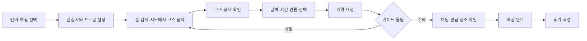
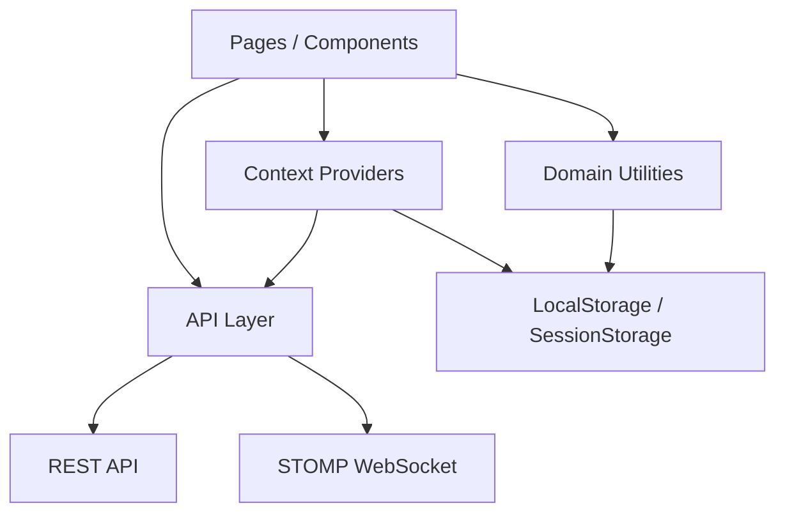

<div align="center">
  

  # Tomorang

  **나의 첫 번째 로컬 친구, 토모랑**

  검색 결과만으로는 발견하기 어려운 현지의 장소와 경험을<br />
  로컬 가이드와 여행자의 연결을 통해 발견하는 여행 플랫폼입니다.

  [서비스 바로가기](https://2025-japan-internship.github.io/Tomorang_Client/) · [GitHub Repository](https://github.com/2025-Japan-Internship/Tomorang_Client)
</div>

---

## 프로젝트 소개

기존 여행 서비스에서는 유명 관광지와 광고성 콘텐츠가 상단을 차지해, 현지인이 알고 있는 조용한 장소나 작은 가게를 찾기 어렵습니다. 토모랑은 여행자의 관심사와 현재 위치를 바탕으로 로컬 가이드의 코스를 탐색하고, 예약부터 만남과 후기까지 하나의 흐름으로 연결합니다.

| 구분 | 내용 |
| --- | --- |
| 개발 기간 | 2026.02 - 2026.06 |
| 플랫폼 | Mobile Web / PWA |
| 주요 사용자 | 숨은 여행지를 찾는 여행자, 자신만의 코스를 소개하는 로컬 가이드 |
| 지원 언어 | 한국어, 일본어 |
| 프론트엔드 | React 19, Vite 7, JavaScript |

### 해결하고자 한 문제

- 검색 노출 순위가 아닌 **현지인의 경험을 기준으로 여행지를 발견**할 수 있어야 합니다.
- 낯선 지역에서도 코스 탐색, 예약, 가이드와의 소통이 **서비스 안에서 끊김 없이 이어져야** 합니다.
- 여행자와 가이드가 같은 앱을 사용하되, 역할에 따라 필요한 정보와 행동이 **명확하게 구분되어야** 합니다.

## 주요 기능

### 1. 취향 기반 로컬 코스 탐색

- 온보딩에서 언어와 관심사를 선택하고 여행자 프로필을 구성합니다.
- 인기 코스, 인기 가이드, 급상승 여행지와 카테고리별 코스를 탐색합니다.
- 검색과 필터, 찜 기능을 통해 관심 있는 코스를 모아볼 수 있습니다.

### 2. 위치 기반 지도 탐색

- 브라우저 Geolocation과 Leaflet을 활용해 현재 위치 주변의 코스를 표시합니다.
- Haversine 공식을 적용해 사용자와 코스 간 거리를 계산하고 가까운 순으로 정렬합니다.
- 지도 마커, 선택 코스 카드, 드래그 가능한 바텀 시트를 연동해 모바일 지도 탐색 경험을 구성했습니다.

### 3. 여행자·가이드 양방향 예약

- 여행자는 코스의 날짜, 시간, 인원을 선택해 예약을 요청합니다.
- 가이드는 자신의 코스를 등록·수정하고 들어온 예약을 수락하거나 거절합니다.
- `PENDING → CONFIRMED → COMPLETED` 상태에 따라 만남 장소, 채팅, 후기 작성 기능을 단계적으로 제공합니다.
- 예약 가능 인원과 슬롯 상태를 계산해 마감된 시간과 코스를 즉시 구분합니다.

### 4. 실시간 채팅과 번역

- STOMP WebSocket으로 채팅방을 구독해 메시지를 실시간으로 주고받습니다.
- 연결이 끊기면 자동 재연결하고, 기존 대화 내역과 읽음 상태를 REST API로 동기화합니다.
- 이미지 전송과 한·일 메시지 번역을 지원해 여행자와 가이드 사이의 언어 장벽을 낮췄습니다.

### 5. 후기·알림·사용자 관리

- 여행 완료 후 별점과 여러 장의 이미지를 포함한 후기를 작성할 수 있습니다.
- 예약과 후기 관련 알림을 확인하고 개별 또는 전체 읽음 처리할 수 있습니다.
- 사용자 숨김, 신고, 찜, 리뷰 좋아요 등 서비스 운영에 필요한 상호작용을 지원합니다.

## 사용자 흐름



## 프론트엔드 설계



### API 응답 정규화

백엔드 응답의 `camelCase`, `snake_case`, 중첩 구조 차이를 화면 컴포넌트에서 직접 처리하지 않도록 API 계층에서 게시글, 후기, 알림 데이터를 정규화합니다. 공통 `apiFetch`에서 JWT 만료, 인증 헤더, JSON 파싱과 오류 메시지를 처리해 페이지별 네트워크 코드를 단순화했습니다.

### 모바일 뷰포트 대응

393px 기준의 앱 레이아웃을 유지하면서 작은 화면에도 대응하도록 CSS 변수를 구성했습니다. `Visual Viewport API`로 모바일 키보드 높이를 반영하고, safe area와 하단 내비게이션 영역을 계산해 입력창이나 주요 버튼이 가려지는 문제를 줄였습니다.

### 흐름이 끊기지 않는 상태 관리

예약 데이터는 Context로 공유하고 서버 응답을 기준으로 갱신합니다. 페이지 새로고침이나 직접 진입에도 상세 화면을 복원할 수 있도록 필요한 데이터를 `sessionStorage`에 보조 저장하고, 찜과 인증 정보는 `localStorage`와 동기화했습니다.

### 역할 중심 라우팅

하나의 애플리케이션 안에서 여행자와 가이드의 홈, 예약 목록, 마이페이지를 분리했습니다. 저장된 사용자 역할에 따라 올바른 시작 화면으로 이동시키고, 동일한 예약 데이터도 게시글 소유 여부에 따라 요청자 화면과 가이드 화면으로 다르게 표현합니다.

## 기술 스택

| 영역 | 기술 | 사용 목적 |
| --- | --- | --- |
| Core | React 19, JavaScript | 컴포넌트 기반 UI와 상태 관리 |
| Build | Vite 7, Yarn 4 | 개발 서버, 번들링, 의존성 관리 |
| Routing | React Router 7 | 역할별 화면과 사용자 흐름 구성 |
| Styling | styled-components, CSS | 컴포넌트 스타일과 모바일 레이아웃 |
| Map | Leaflet, React Leaflet | 위치 기반 코스 탐색과 지도 UI |
| Realtime | STOMP.js, WebSocket | 실시간 채팅 및 자동 재연결 |
| API | Fetch API, REST | 인증, 예약, 게시글, 후기 데이터 연동 |
| Localization | Context API, MutationObserver | 한국어·일본어 전역 전환 |
| Deploy | GitHub Actions, GitHub Pages | 빌드 및 배포 자동화 |

## 폴더 구조

```text
src/
├── api/          # REST API, 인증, WebSocket 클라이언트
├── assets/       # 아이콘과 정적 리소스
├── components/   # 공통 및 도메인별 UI 컴포넌트
├── data/         # 화면 구성용 정적 데이터
├── hooks/        # 공통 React 훅
├── i18n/         # 언어 상태와 번역 리소스
├── layouts/      # 공통 페이지 레이아웃
├── pages/        # 라우트 단위 페이지
├── router/       # 라우팅과 모바일 뷰포트 처리
└── utils/        # 예약, 찜, 후기 등 도메인 로직
```

## 시작하기

### 요구 사항

- Node.js 22
- Corepack

### 설치 및 실행

```bash
git clone https://github.com/2025-Japan-Internship/Tomorang_Client.git
cd Tomorang_Client
corepack enable
yarn install --immutable
yarn dev
```

필요한 경우 프로젝트 루트에 `.env` 파일을 생성해 서버 주소를 변경할 수 있습니다.

```env
VITE_API_BASE_URL=https://your-api.example.com
VITE_CHAT_SOCKET_URL=wss://your-api.example.com/ws
```

| 명령어 | 설명 |
| --- | --- |
| `yarn dev` | 로컬 개발 서버 실행 |
| `yarn build` | 프로덕션 빌드 생성 |
| `yarn preview` | 프로덕션 빌드 미리보기 |
| `yarn lint` | ESLint 정적 검사 |

## 배포

`main` 브랜치에 변경 사항이 반영되면 GitHub Actions가 Node.js와 Yarn 환경을 구성하고 프로덕션 빌드를 GitHub Pages에 배포합니다. SPA의 직접 경로 접근을 지원하기 위해 빌드 결과의 `index.html`을 `404.html`로 복제합니다.
